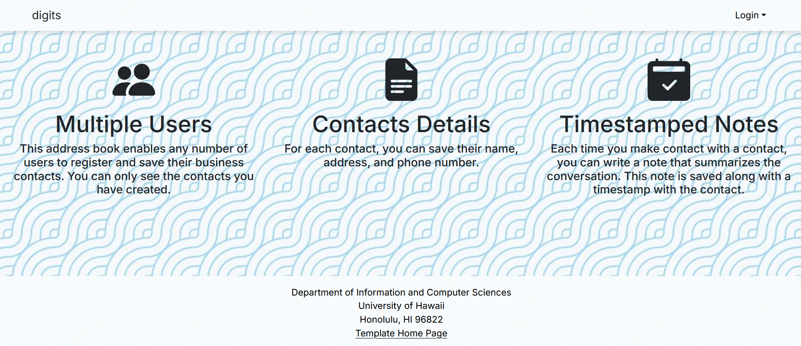
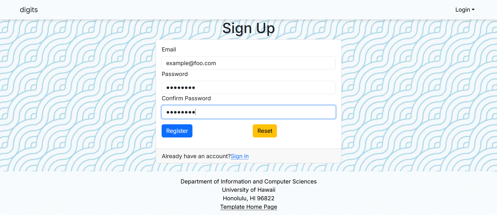
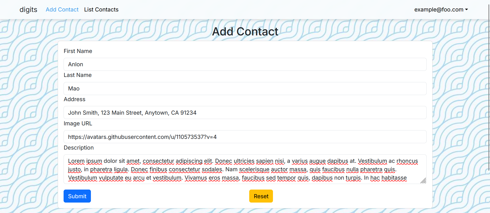
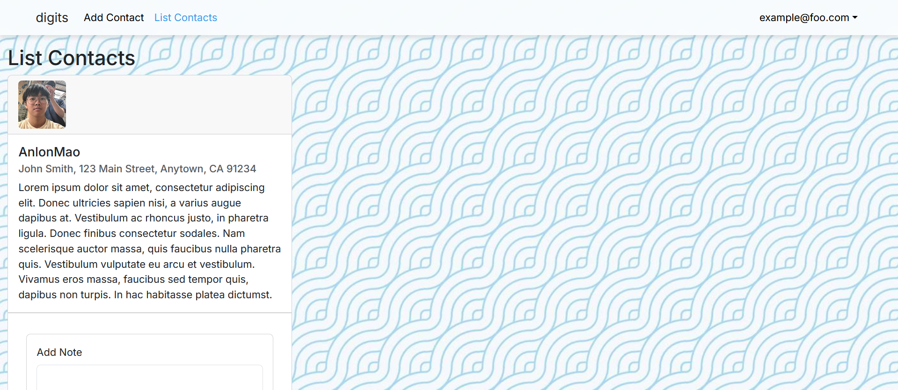
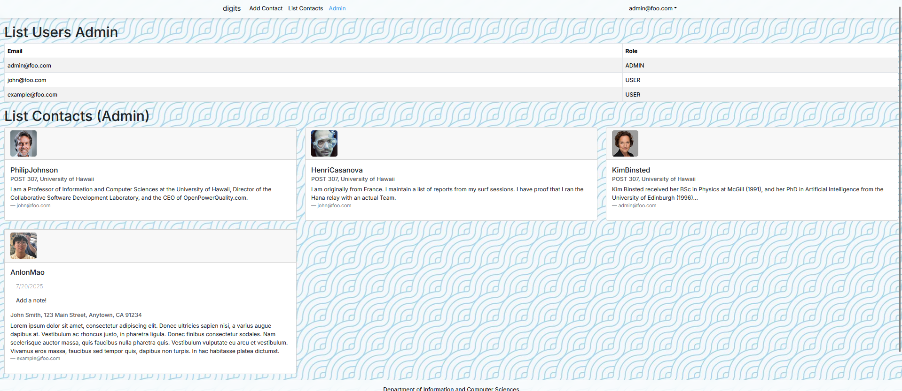

# Digits App (Next.js 14)

This is a modern web application for managing contact information using the Next.js 14 App Router framework.

It demonstrates:

- A clean directory layout using `src/` as recommended by [Next.js](https://nextjs.org/docs/getting-started/project-structure)
- PostgreSQL with Prisma ORM
- [Bootstrap 5 React](https://react-bootstrap.github.io/) for UI components
- [React Hook Form](https://react-hook-form.com) and [Yup](https://github.com/jquense/yup) for validated forms
- User authentication and role-based access control via [NextAuth.js](https://next-auth.js.org/)
- ESLint configuration following Next.js and Airbnb standards

---

## 🚀 Installation

1. **Install PostgreSQL** and create a database:

```bash
createdb digits
````

2. **Clone your repo** from GitHub:

```bash
git clone git@github.com:<your-username>/<your-repo>.git
cd <your-repo>
```

3. **Install dependencies**:

```bash
npm install
```

4. **Set up environment variables**:

Copy `.env.sample` to `.env` and edit the `DATABASE_URL` to match your local Postgres setup.

5. **Push Prisma schema to database**:

```bash
npx prisma migrate dev
```

6. **Seed the database**:

```bash
npx prisma db seed
```

---

## ▶️ Running the App

Start the development server:

```bash
npm run dev
```

Go to: [http://localhost:3000](http://localhost:3000)

---

## 🖼️ Walkthrough

### Landing Page


Landing page introduces the app and allows users to sign in or register.

---

### Sign In Page



Users can sign in using credentials defined in `settings.development.json` or by creating an account.

---

### Add Contact Page



Users can add contacts with a name, description, address, and image.

---

### List Contacts Page



Shows the logged-in user’s saved contacts. Includes dynamic routing and edit/delete functionality.

---

### Admin Page



Only visible to users with the `ADMIN` role. Lists all contacts created by any user and all user roles.

---

## 🗃️ Directory Structure

```txt
src/
  app/
    add/               # Add Contact page
    list/              # List Contacts page
    admin/             # Admin Dashboard
    auth/              # Signin, Signout, Signup
  components/          # Shared UI components
  lib/                 # Utility and database functions
  prisma/              # Prisma schema and seed
  config/              # Default user/contact seed data
  doc/                 # Screenshots for GitHub Pages
```

---

## ✅ Linting

To check code quality with ESLint:

```bash
npm run lint
```
---

## 👤 Author

**Anlon Mao**
ICS 314 - Summer 2025
University of Hawaiʻi at Mānoa

```
